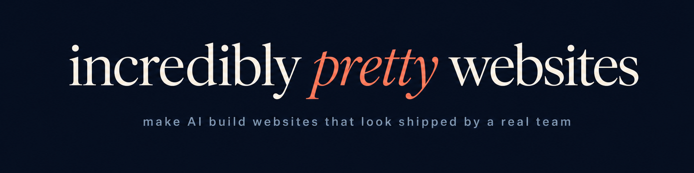
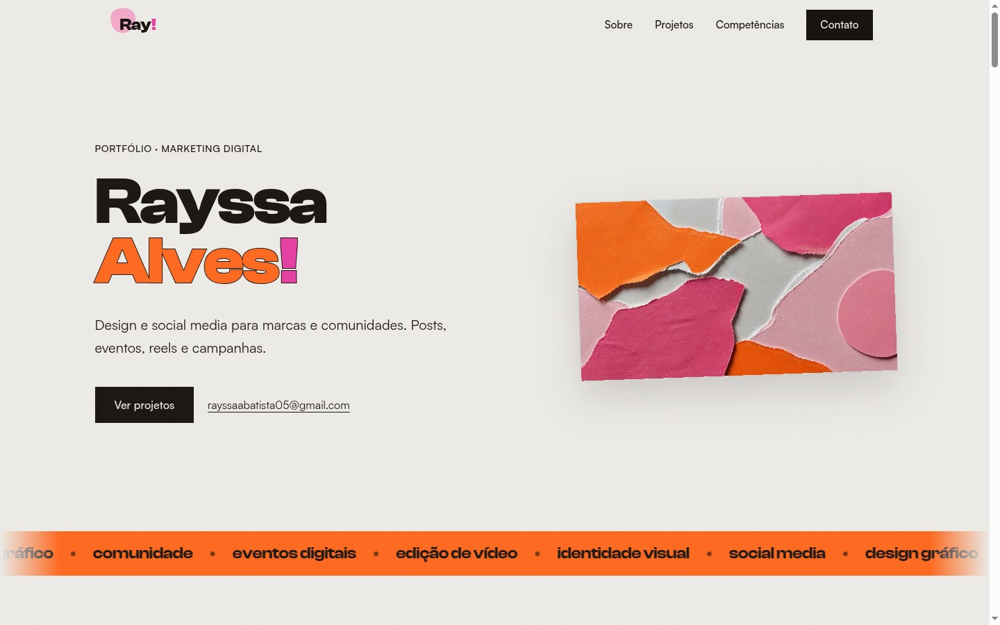
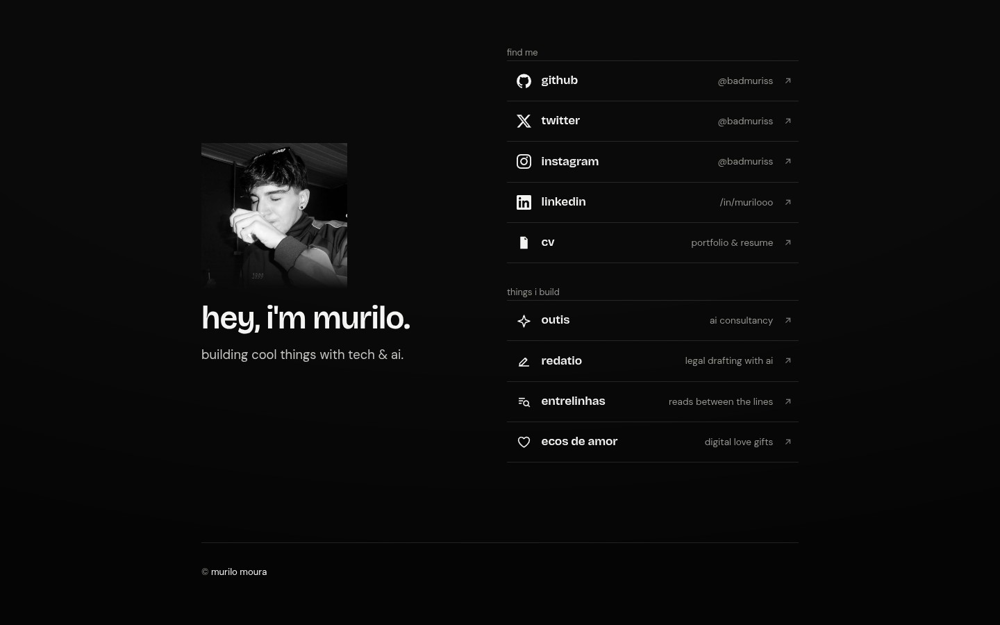
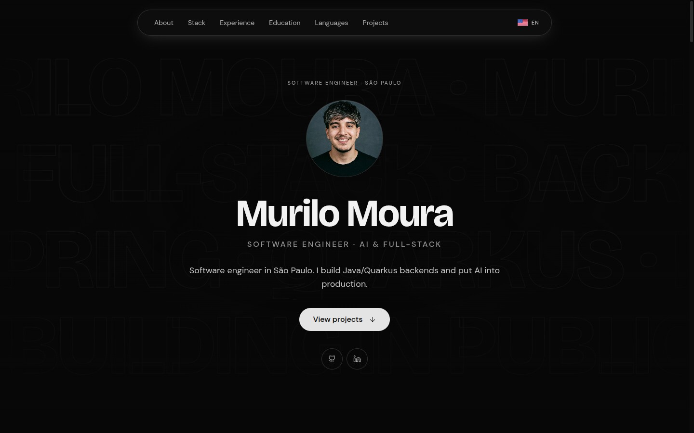

<p align="center"></p>

<p align="center"><b>Make AI build websites that look like a real product team shipped them.</b></p>

<p align="center">
  <a href="LICENSE"></a>
  <a href="https://skills.sh"></a>
  <a href="https://github.com/badmuriss/incredibly-pretty-websites/stargazers"></a>
  <a href="https://github.com/badmuriss/incredibly-pretty-websites/commits/main"></a>
</p>

<p align="center">
  <a href="#install">Install</a> ·
  <a href="#how-to-prompt-it">How to prompt it</a> ·
  <a href="#built-with-it">Built with it</a> ·
  <a href="#whats-inside">What's inside</a> ·
  <a href="#pairs-with-site-audit">Pairs with site-audit</a> ·
  <a href="#the-stack-it-recommends">The stack it recommends</a>
</p>

## Install

```bash
npx skills add badmuriss/incredibly-pretty-websites
```

Works with Claude Code and any agent supporting the [skills](https://skills.sh) format. Manual alternative:

```bash
git clone https://github.com/badmuriss/incredibly-pretty-websites ~/.claude/skills/incredibly-pretty-websites
```

Then ask your agent to build a site. The skill triggers on frontend and design work, or you can invoke it by name. It runs in Claude Code, Codex, OpenCode and Cursor, anywhere the [skills](https://skills.sh) format works, and it works fully on its own. The premium integrations below stay optional.

Most AI-generated sites share the same tells: the same handful of default fonts everywhere, a purple gradient glow, three identical card columns, a pulsing green "online" dot, mono font on every label, an oversized H1 that fills the screen. This skill is a system for avoiding all of that on purpose: design dials tuned per segment, vibe and layout archetypes, a motion engine with real easing and duration rules, a font catalog with opinions, and a hard list of the AI tells to never ship.

**React-first.** Vue and vanilla CSS/JS are first-class too. If nothing is specified, it assumes React.

## How to prompt it

The skill runs its own brief internally: what / for whom / goal / tone / constraints. The more of that you hand it up front, the less it has to guess. A prompt that covers everything looks like this:

> Build a landing page for **[niche, e.g. an architecture studio]** whose goal is **[the conversion, e.g. booking a consultation]**. Audience: **[who]**. Tone: **[e.g. sober and editorial]**. Premium level: **[basic / moderate / full premium, with GSAP, smooth scroll and scroll-telling]**. Colors and identity: **[palette, fonts, logo, or "derive from the references"]**. References I like: **[2 or 3 real sites]**.

Three things carry most of the weight:

1. **The niche decides almost everything on its own.** The skill maps each segment to a preset row: a law firm gets restraint, a SaaS gets the full package (GSAP ScrollTrigger, Lenis smooth scroll, liquid glass, bento grids). Naming the niche alone already lands the right tier. Stating the premium level explicitly is how you force it above or below the segment's default.

2. **References beat adjectives.** "Modern and clean" says nothing; "I like linear.app and vercel.com" says everything. The skill opens the sites, reads their actual font stacks and CSS custom properties, and locks the direction to that evidence before writing any code.

3. **You don't need anything paid.** Refero and Magnific are accelerators only. Research runs for free by reading live sites, the curated galleries (siteinspire, httpster, minimal.gallery) and the open-source DESIGN.md packs; photos come from Pexels, Unsplash and Pixabay, and every font in the catalog is free (Fontshare, Google Fonts). The prompt is the same with or without the paid tools.

A complete example:

> Build a landing page for a specialty coffee shop in Curitiba, goal: drive store visits and sell beans online. Audience: 25 to 40, design-conscious. Tone: editorial, warm, artisanal. Level: moderate, with entrance animations and a premium touch without excess. Earthy palette, no pure white. Reference: I like the Blue Bottle Coffee site.

## Built with it

Four sites, four canvases, four type systems, no shared template.

<table>
<tr>
<td width="50%" valign="top">
<a href="https://rayssaalves.com"></a>
<p><b><a href="https://rayssaalves.com">rayssaalves.com</a></b>, a portfolio for a social media designer<br>
<sub>Clash Display + Satoshi on a warm paper canvas (<code>#edebe7</code>), orange and magenta accents, scroll-telling with GSAP ScrollTrigger + Lenis. React + Vite + vite-react-ssg, prerendered.</sub></p>
</td>
<td width="50%" valign="top">
<a href="https://muriloo.dev"></a>
<p><b><a href="https://muriloo.dev">muriloo.dev</a></b>, a personal link-in-bio in noir<br>
<sub>Bricolage Grotesque + DM Sans on <code>#0a0a0b</code>, an SVG <code>feTurbulence</code> grain at 5.5% over a vignette, grayscale portrait with a masked fade, hairline-divided link rows. One static HTML file, inline CSS, zero JS.</sub></p>
</td>
</tr>
<tr>
<td width="50%" valign="top">
<a href="https://outis.com.br"></a>
<p><b><a href="https://outis.com.br">outis.com.br</a></b>, an AI and technology consultancy<br>
<sub>Self-hosted Sora 600 over Plus Jakarta Sans on a white canvas with a pale violet wash, violet-700 accent, and glass cards mocking real product UI (a Google result, a +340% traffic chart, an SEO gauge) instead of gray placeholder blocks. React + Vite, prerendered, on Cloudflare.</sub></p>
</td>
<td width="50%" valign="top">
<a href="https://cv.muriloo.dev"></a>
<p><b><a href="https://cv.muriloo.dev">cv.muriloo.dev</a></b>, a one-page CV<br>
<sub>The muriloo.dev type system in monochrome: every <code>oklch</code> token at chroma 0, JetBrains Mono for the data, outlined type as ground, Lenis smooth scroll. React + Vite.</sub></p>
</td>
</tr>
</table>

## What's inside

- **`SKILL.md`** holds the core: research-first workflow, project-type presets, design dials, vibe/layout archetypes, the animation engine, a typography catalog, ~60 forbidden "AI tells," and a review checklist.
- **`reference/`** holds the technical foundations:
  - `spatial-design.md`: 4pt scale, hierarchy, container queries
  - `motion-design.md`: easing curves, durations, a transition pattern catalog
  - `interaction-design.md`: the 8 interactive states, focus-visible, popovers, modals
  - `responsive-design.md`: mobile-first, pointer queries, safe-area, srcset
  - `framework-adapters.md`: React / Vue / vanilla equivalents for motion, state, hydration
  - `component-libs.md`: copy-in animated components (Magic UI, React Bits, animated Lucide icons)
  - `scroll-motion.md`: GSAP ScrollTrigger + Lenis smooth-scroll, with perf/a11y guardrails
  - `design-references.md`: the free research layer, covering live-site token extraction, DESIGN.md packs, free galleries, public design systems and a segment-to-references bank
  - `media-pipeline.md`: free stock photography with the per-source hosting rules, plus image→video via Magnific
  - `redesign.md`: redesign mode (Scan, Diagnose, Fix) with the what-never-changes-silently list

## Pairs with site-audit

This skill builds. [**site-audit**](https://github.com/badmuriss/site-audit) verifies what got built, against a live URL.

```bash
npx skills add badmuriss/site-audit
```

The split is deliberate, and it is why neither one carries the other's rules:

| | incredibly-pretty-websites | site-audit |
|---|---|---|
| Runs on | a brief, a repo, a blank page | a reachable URL or a local dev server |
| Owns | typography, color, layout, motion, components, copy tone, the AI-tells list | on-page SEO, AEO/GEO, axe-core, Core Web Vitals, the UX walkthrough |
| Output | a built site | one severity-ranked report with hard gates |

Build to the §14 pre-flight, deploy, then point site-audit at the URL. Redesigning instead of building fresh? Run site-audit **first** as well: its report is the baseline the redesign has to protect.

## The stack it recommends

The skill is built around a specific set of tools. The free layer alone is enough to build genuinely beautiful sites; the premium layer buys speed on the research and media steps.

**Free, open-source (the default):**
- [shadcn](https://ui.shadcn.com), the registry that serves the copy-in components
- [Magic UI](https://magicui.design), Tailwind + Motion animated components, the default arsenal
- [React Bits](https://reactbits.dev) / [Vue Bits](https://vue-bits.dev) for text effects, galleries and WebGL spectacle
- [GSAP](https://gsap.com) + [Lenis](https://lenis.darkroom.engineering) for scroll-telling and smooth scroll
- [Motion](https://motion.dev), the animation library that succeeded Framer Motion
- [Phosphor Icons](https://phosphoricons.com), the icon set (static Lucide is banned on purpose)
- [Fontshare](https://fontshare.com) + [Google Fonts](https://fonts.google.com) + [Geist](https://vercel.com/font) behind the font catalog

**Free research and media layer, no account and no budget ([`design-references.md`](reference/design-references.md) + [`media-pipeline.md`](reference/media-pipeline.md)):**
- Reading the live site itself: `curl`/WebFetch the HTML, pull the font links and the CSS custom properties, screenshot at 1440 and 390. Stronger evidence than any gallery screenshot, which is why it's route A.
- [VoltAgent/official-design-md](https://github.com/VoltAgent/official-design-md) (first-party) + [VoltAgent/awesome-design-md](https://github.com/VoltAgent/awesome-design-md) (70+ reverse-engineered brands): DESIGN.md packs, treated as hypotheses to verify rather than as brand documentation
- [siteinspire](https://www.siteinspire.com), [httpster](https://httpster.net), [minimal.gallery](https://minimal.gallery), [One Page Love](https://onepagelove.com) (8,500+ isolated page *sections*), [dark.design](https://dark.design), [navbar.gallery](https://navbar.gallery), [footer.design](https://footer.design)
- [Pexels](https://www.pexels.com/api/documentation/), [Unsplash](https://unsplash.com/documentation), [Pixabay](https://pixabay.com/api/docs/) and the public-domain archives (Openverse, Wikimedia, Met, Smithsonian, NASA), with each source's contradictory hosting rules spelled out, because Unsplash *requires* hotlinking and Pixabay *forbids* it

**Premium, optional (the accelerators):**
- [Refero](https://refero.design), real shipped-product references searchable by style, screen and flow. It speeds route A up without removing the step.
- [Magnific](https://magnific.ai), licensed stock plus image→video generation for Tier 3 hero loops, self-hosted and cost-gated. Video generation is the one capability here with no free equivalent.

## The philosophy in one line

Research real products before writing a line, pick a taste direction and commit to it (never the lukewarm average), then execute with a system that has an opinion about every pixel.

## License

MIT. See [`LICENSE`](LICENSE).

Built by [Murilo Moura](https://github.com/badmuriss).
